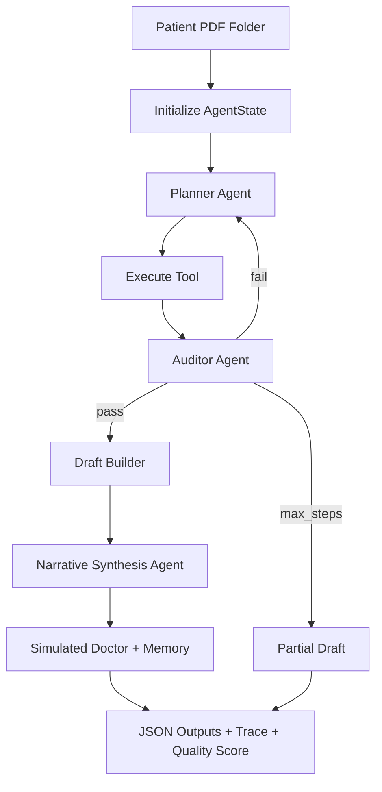
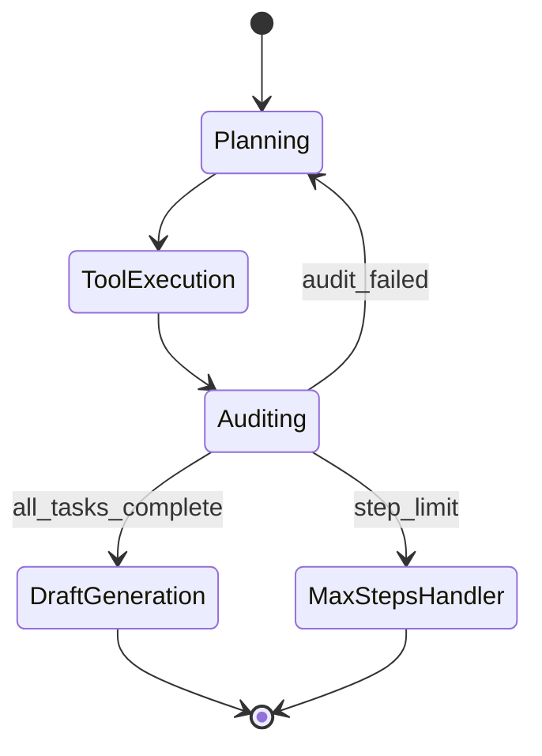

# Clinical Discharge Summary Agent

A LangGraph-based agentic AI system that processes patient PDF folders and generates **structured discharge summary drafts for clinician review** — never final clinical documents.

## Why This Project Stands Out

This is **not** a PDF → LLM → summary pipeline. It is a **multi-agent clinical workflow**:

1. **Planner** orchestrates tools in a LangGraph loop (max 20 steps)
2. **Tools** extract evidence, reconcile meds, detect conflicts/missing/pending/interactions
3. **Auditor** validates evidence substrings and task completion
4. **Narrative Synthesis Agent** produces attending-style prose + executive summary (evidence-grounded)
5. **Simulated Doctor + Correction Memory** apply formatting learnings from prior edits
6. **Rubric evaluator** scores readability, grounding, safety compliance, and completeness

### Recruiter Demo (2 minutes)

```bash
pip install -r requirements.txt
cp .env.example .env   # add ANTHROPIC_API_KEY optional
streamlit run app/ui/streamlit_app.py
```

1. Sidebar → `complete_1` → **Load Sample PDFs** → **Run Agent**
2. Open **Clinical Narrative** tab → read executive summary + polished sections
3. Open **Before / After** tab → show extraction vs synthesis
4. Open **Agent Trace** → show `narrative_agent` synthesis step with quality score

```bash
python scripts/generate_feature_fixtures.py
python scripts/run_feature_tests.py mock
python scripts/evaluate_summary_quality.py mock 15
```

## Quick Start

```bash
# Install dependencies
pip install -r requirements.txt

# Scanned PDFs (image-only charts) require Tesseract OCR
# Windows:
winget install UB-Mannheim.TesseractOCR

# Configure API keys
cp .env.example .env
# Edit .env with your OpenAI/Anthropic/Gemini keys

# Run Streamlit UI (from project root)
streamlit run app/ui/streamlit_app.py

# Windows shortcut
run_streamlit.bat

# Or via Docker
docker compose up
```

### Reviewer sample: `patient 2 (1).pdf` (71-page scanned chart)

1. Install Tesseract (see above)
2. Copy the PDF into the project:
   ```powershell
   mkdir fixtures\patient_real
   copy "C:\Users\Viren\Downloads\patient 2 (1).pdf" fixtures\patient_real\
   ```
3. **Streamlit:** Sidebar → **Load Reviewer Sample** → **Run Agent** (OCR progress shown during load)
4. **CLI smoke test:**
   ```powershell
   $env:PYTHONPATH='.'
   python scripts/run_real_patient_test.py
   ```

The PDF has no copyable text layer — the agent runs OCR automatically when PyMuPDF/pdfplumber extract nothing.

## Architecture



## Agent Workflow



## Safety Architecture

- **Evidence-first**: Every fact requires provenance (document, page, timestamp)
- **No hallucinations**: Auditor validates evidence substrings against source text
- **Missing data**: `MISSING – CLINICIAN REVIEW REQUIRED`
- **Conflicts**: `CONFLICT DETECTED – CLINICIAN REVIEW REQUIRED` (never auto-resolved)
- **Pending results**: `PENDING` (never fabricated)
- **Max steps**: Hard cap of 20 steps
- **Always draft**: Banner on all outputs, `is_final: false`

## Project Structure

```
app/
  agents/       planner, auditor, discharge_agent, draft_builder
  tools/        pdf_reader, reconciliation, detectors, escalation
  llm/          provider-agnostic LLM interface (6 providers + mock)
  models/       AgentState, Evidence, Summary models
  memory/       correction_memory (SQLite)
  evaluation/   simulated_doctor, metrics, evaluation_runner
  observability/ trace_writer
  ui/           streamlit_app.py
config/config.yaml
tests/          unit, integration, e2e, safety, failure, performance, regression
fixtures/       patient PDF folders (user-provided)
outputs/        generated JSON artifacts
traces/         execution traces
```

## LLM Provider Configuration

Set in `config/config.yaml` or `.env`:

```yaml
llm_provider: gemini  # openai | anthropic | gemini | azure | ollama | huggingface
```

Switch providers without code changes.

## Outputs

For each patient run, outputs are written to `outputs/{patient_id}/`:

- `discharge_summary_draft.json`
- `medication_reconciliation.json`
- `conflict_report.json`
- `pending_results.json`
- `clinician_review_queue.json`
- `safety_flags.json`
- `evidence_store.json`

Traces: `traces/{patient_id}_{timestamp}.json` and `.txt`

## Testing

```bash
pytest tests/ -v
pytest tests/unit/          # Unit tests (no PDFs required)
pytest tests/integration/   # Integration tests
pytest tests/e2e/           # End-to-end with generated PDFs
pytest tests/safety/        # Safety rule enforcement
```

### Feature Test Suite (53 scenarios, 285 PDFs)

Generate fixtures and run **behavioral** feature assertions (safety rules, missing/conflict/pending handling, traces, artifacts):

```bash
python scripts/generate_feature_fixtures.py
python scripts/run_feature_tests.py mock        # deterministic, no API key
python scripts/run_feature_tests.py anthropic   # live LLM (claude-haiku-4-5)
```

Report written to `outputs/feature_test_report.json`.

### Summary Quality (what clinicians read)

Discharge drafts are **polished into readable clinical prose** after evidence extraction — not raw `field; field; field` concatenation.

- Rule-based narrative polish (always on): demographics as prose, merged hospital course, bullet med/lab lists
- Optional LLM polish (`narrative.llm_enhance` in `config/config.yaml`): Hospital Course and Follow-up only, with evidence grounding checks
- Full document view: `narrative_summary` markdown in JSON output and **Clinical Narrative** tab in Streamlit

Score sample summaries:

```bash
python scripts/evaluate_summary_quality.py mock 10
python scripts/evaluate_summary_quality.py anthropic 10
```

Report: `outputs/summary_quality_report.json` (higher = clearer prose while preserving safety literals).

**Example (`complete_1`) — before vs after narrative polish:**

| Section | Before | After |
|---------|--------|-------|
| Demographics | `Name: John Doe; DOB: 01/15/1970` | `John Doe (DOB 01/15/1970).` |
| Hospital Course | `Patient treated...; Patient improving.` | `Patient treated with antibiotics and improved.` (redundant progress note merged) |
| Discharge Meds | `Lisinopril...; Warfarin...` | Bulleted regimen list |

#### Latest Results (2026-06-03)

| Provider | Scenarios | PDFs | Pass Rate | Avg Quality |
|----------|-----------|------|-----------|-------------|
| mock | 53/53 | 285 | 100% | ~90/100 |
| anthropic (`claude-haiku-4-5-20251001`) | 50/50 | 273 | 100% | run locally |

**pytest:** 68 passed, 1 skipped — last run 2026-06-03.

**Scenario categories exercised:**

| Category | Count | What is validated |
|----------|-------|-------------------|
| complete | 15 | Full draft, evidence provenance, no false demographic conflicts |
| missing | 7 | `MISSING – CLINICIAN REVIEW REQUIRED` on absent fields |
| conflicts | 4 | `CONFLICT DETECTED – CLINICIAN REVIEW REQUIRED` (never auto-resolved) |
| pending | 3 | `PENDING` results surfaced in draft and safety flags |
| med_discrepancy | 6 | Admission vs discharge med changes + review queue |
| interactions | 4 | High-risk drug interaction safety flags |
| multi_flags | 6 | Combined missing + conflict + pending + med issues |
| performance | 5 | Large folders (10–20 PDFs), trace step limits |
| unstructured | 3 | Narrative-style H&P notes (prose extraction) |

**Per-scenario assertions include:** draft generation with `is_final=false`, section status (Present/Missing/Conflict/Pending), evidence store minimums, conflict/pending/med-change detection, safety flag categories, JSON artifact outputs, agent trace steps, and **minimum narrative quality score**.

**pytest:** 68 passed, 1 skipped (live Gemini quota), 7 warnings — last run 2026-06-03.

#### Browser E2E (Streamlit UI)

Manual verification via Streamlit at `http://localhost:8501`:

1. Sidebar → select fixture scenario (50 available)
2. **Load Sample PDFs** → **Run Agent**
3. Verify tabs: Discharge Draft, Safety & Review, Medications, Conflicts, Evidence, Agent Trace, Download

**Verified scenarios:** `complete_1` (full draft, med reconciliation, pending culture, 7-step trace, ZIP download). UI shows metrics row, color-coded section statuses, clinician review queue, and artifact path under `outputs/{patient_id}/`.

## Deployment

```bash
docker compose up --build
# Open http://localhost:8501
```

## Part 2: Learning Loop

- **Simulated Doctor**: Rule-based editor generating (draft, edited) pairs
- **Correction Memory**: SQLite store of formatting improvements
- **Evaluation Runner**: Train/val/test splits with reward metrics

```bash
python -c "from app.evaluation.evaluation_runner import EvaluationRunner; EvaluationRunner().run_full_evaluation()"
```

## Assignment Compliance Matrix

| Requirement | Implementation | Tests |
|-------------|----------------|-------|
| Agent loop (not PDF→LLM→Summary) | `app/agents/discharge_agent.py` LangGraph | `tests/e2e/` |
| AgentState with all fields | `app/models/agent_state.py` | `tests/unit/` |
| MAX_STEPS = 20 | `agent_state.py`, graph router | `tests/performance/` |
| Evidence provenance | `app/models/evidence.py` | `tests/unit/test_auditor.py` |
| PDF reader with retry/fallback/OCR | `app/tools/pdf_reader.py` | `tests/unit/test_pdf_reader.py` |
| Missing data detector | `app/tools/missing_data_detector.py` | `tests/unit/test_missing_data_detector.py` |
| Conflict detector | `app/tools/conflict_detector.py` | `tests/unit/test_conflict_detector.py` |
| Medication reconciliation | `app/tools/medication_reconciliation.py` | `tests/unit/test_medication_reconciliation.py` |
| Pending result detector | `app/tools/pending_result_detector.py` | `tests/unit/test_pending_result_detector.py` |
| Drug interaction checker | `app/tools/interaction_checker.py` | integration |
| Escalation tool | `app/tools/escalation_tool.py` | `tests/unit/test_escalation_tool.py` |
| Planner agent | `app/agents/planner.py` | `tests/integration/test_planner_tools.py` |
| Auditor agent | `app/agents/auditor.py` | `tests/unit/test_auditor.py` |
| Provider-agnostic LLM | `app/llm/` | `tests/integration/test_provider_switching.py` |
| Execution trace | `app/observability/trace_writer.py` | `tests/e2e/` |
| Correction memory | `app/memory/correction_memory.py` | `tests/integration/test_learning_loop.py` |
| Simulated doctor | `app/evaluation/simulated_doctor.py` | `tests/integration/test_learning_loop.py` |
| Evaluation framework | `app/evaluation/evaluation_runner.py` | integration |
| Narrative synthesis agent | `app/agents/narrative_agent.py` | `tests/unit/test_narrative_agent.py` |
| Summary quality rubric | `app/evaluation/summary_rubric.py` | `tests/unit/test_summary_rubric.py` |
| Streamlit UI | `app/ui/streamlit_app.py` | manual + feature fixtures |
| Docker deployment | `Dockerfile`, `docker-compose.yml` | manual |

## License

Assignment project — internal use.

## Submission (Dscribe take-home)

- **Assignment write-up:** [SUBMISSION.md](SUBMISSION.md) — loop design, safety guardrails, Part 2, limitations  
- **Submit checklist:** [SUBMIT.md](SUBMIT.md) — form link, video placeholder, verification commands  
- **Batch all patients:** `python scripts/run_submission_batch.py mock` → `outputs/submission_manifest.json`  
- **Form:** https://docs.google.com/forms/d/e/1FAIpQLSfZPmXIi8AdfBx2lDAw3bObv75ikfGrU-33XBSaLP19mXuM3Q/viewform  
- **Video:** record 3–5 min Loom, paste link into SUBMISSION.md + form (deferred)
