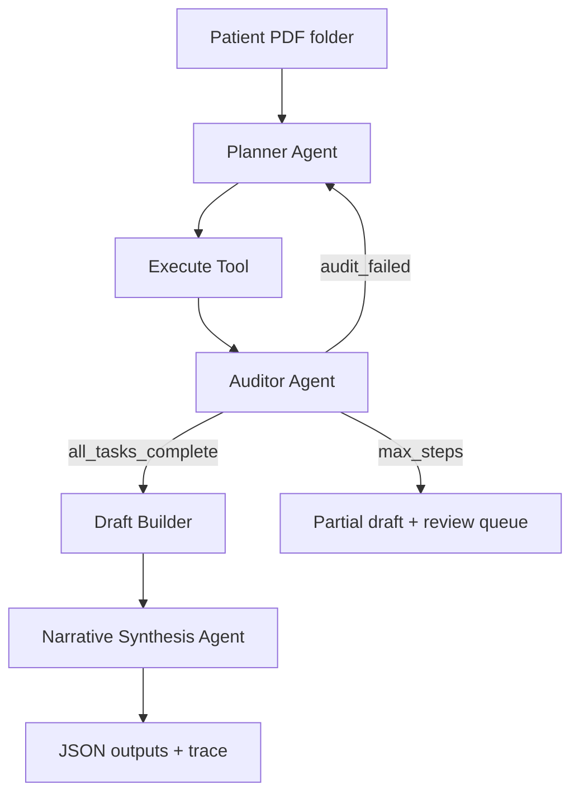

# Assignment Submission — Clinical Discharge Summary Agent

**Candidate submission for Dscribe (Unriddle Technologies) AI Engineer take-home.**  
**Video demo:** [LOOM LINK — to be added before form submission]

---

## 1. Agent loop design

The system is a **LangGraph state machine** (`app/agents/discharge_agent.py`), not a single LLM summarization call.



**Default task plan** (planner executes in order, re-plans on audit failure):

1. `load_documents` — PDF read with retry, parser fallback, OCR for scanned pages  
2. `extract_fields` — evidence store with provenance  
3. `medication_reconciliation`  
4. `detect_missing_fields`  
5. `detect_conflicts`  
6. `detect_pending_results`  
7. `check_interactions`  
8. `finalize_review_queue`  

After all tasks pass audit → draft builder → narrative synthesis agent → simulated doctor formatting + correction memory.

**Hard step cap:** `MAX_STEPS = 20` (`app/models/agent_state.py`).

---

## 2. No-fabrication guardrail

Clinical facts flow through an **evidence store** (`app/models/evidence.py`). Every extracted value carries `source_document`, `page_number`, and `source_text`.

| Situation | Behavior |
|-----------|----------|
| Field not found | `MISSING – CLINICIAN REVIEW REQUIRED` |
| Conflicting values | `CONFLICT DETECTED – CLINICIAN REVIEW REQUIRED` (never auto-resolved) |
| Pending lab/result | `PENDING` (never fabricated) |
| All outputs | `is_final: false` + draft banner |

The **auditor** (`app/agents/auditor.py`) validates that evidence values are substrings of source page text before draft generation proceeds. The narrative agent is instructed to use only provided evidence; LLM polish is optional and guarded.

---

## 3. Failures, conflicts, and recovery

- **PDF read:** PyMuPDF → pdfplumber → Tesseract OCR (`app/tools/pdf_reader.py`); retries + timeout; failures escalate via `escalation_tool.py`  
- **Tool crash:** caught in tool registry; safety flag + clinician review item  
- **Conflicts:** `conflict_detector.py` surfaces multi-source disagreements  
- **Med changes without reason:** flagged in reconciliation report for clinician review  
- **Drug interactions:** mocked high-severity pairs escalate to safety flags  

---

## 4. Part 2 — Learning from doctor edits

**Approach:** contextual **correction memory** (SQLite) injected into draft formatting — not clinical fact overrides.

| Component | File |
|-----------|------|
| Simulated reviewer | `app/evaluation/simulated_doctor.py` |
| Reward metrics | `app/evaluation/metrics.py` (normalized edit distance, section/field accuracy, safety recall) |
| Learning loop | `app/evaluation/evaluation_runner.py` + `app/memory/correction_memory.py` |

**Evaluation method:**

1. **Cold baseline:** clear memory, run train-split patients, average `composite_reward`  
2. **Incremental learning:** for each train patient, simulated doctor produces edits → memory records formatting corrections → re-run same patient → record reward  
3. **Report:** `outputs/evaluation/learning_report.json`

See `learning_report.json` for before/after numbers and per-step learning curve.

**Measured results (mock provider, train split):**

| Metric | Value |
|--------|-------|
| Before (cold memory) | 0.936 |
| After (incremental corrections) | 0.939 |
| Delta | +0.0025 |

Train folders: `complete`, `missing` (see `config/config.yaml` evaluation.train_folders).

**Limitations (honest):**

- Simulated doctor ≠ real clinician; edits are formatting-focused  
- Optimizing edit distance can be gamed (vaguer text); we restrict memory to formatting hints only  
- Safety literals (MISSING/CONFLICT/PENDING) are never overridden by memory  
- Cold-start: limited train split in config  

---

## 5. Generated artifacts (submission deliverables)

| Artifact | Location |
|----------|----------|
| Discharge drafts (all patients) | `outputs/submission_artifacts/{patient_id}/` |
| Execution traces | `traces/submission/` |
| Submission manifest | `outputs/submission_manifest.json` |
| Feature test report | `outputs/feature_test_report.json` |
| Part 2 evaluation | `outputs/evaluation/learning_report.json` |

**Patient data:** 53 assignment-aligned synthetic patients in `fixtures/official_patients/` (285 PDFs). Replace with Google Drive download by copying into that folder (see `fixtures/official_patients/README.md`).

---

## 6. How to reproduce

```powershell
pip install -r requirements.txt
cp .env.example .env   # optional for live LLM

# Run all patients + write manifest
$env:PYTHONPATH='.'
python scripts/run_submission_batch.py mock

# Part 2 evaluation
python -c "from app.evaluation.evaluation_runner import EvaluationRunner; EvaluationRunner().run_full_evaluation('mock')"

# Feature tests + unit tests
python scripts/run_feature_tests.py mock
pytest tests/ -q -m "not slow"

# UI demo
streamlit run app/ui/streamlit_app.py
```

For scanned/image PDFs: `winget install UB-Mannheim.TesseractOCR`

---

## 7. What I would do with more time

- LLM-driven re-planning when audit fails (today: fixed task order + rule auditor)  
- Stronger section detection on OCR text from real hospital scans  
- Real clinician edit pairs for Part 2 instead of simulated doctor  
- Preference tuning (DPO) on (draft, edited) pairs with safety constraints  

---

## 8. Submission checklist

See [SUBMIT.md](SUBMIT.md) for Google Form fields and final steps.
